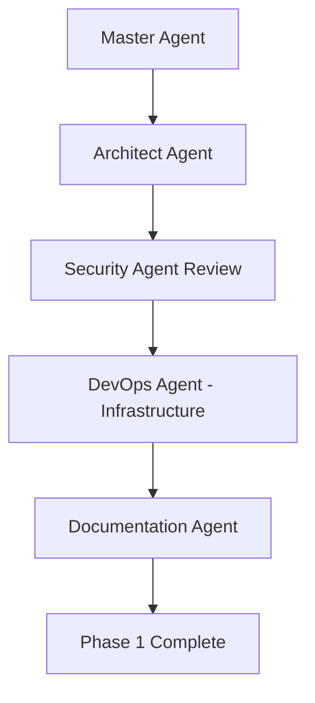
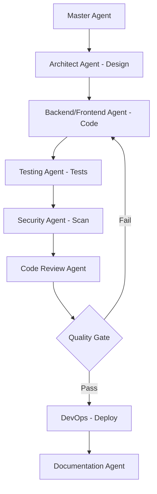
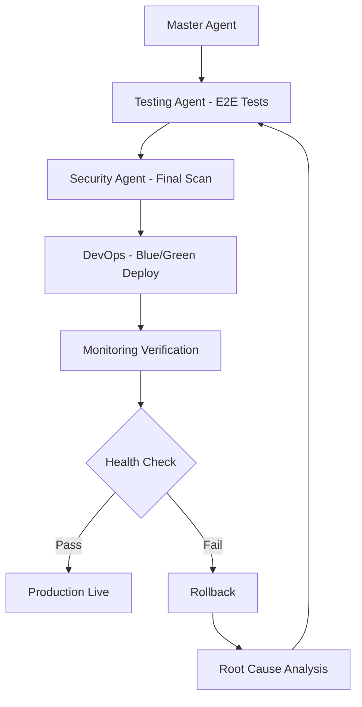

# Master Orchestration Agent

## 🎯 Purpose

The **Master Orchestration Agent** coordinates all specialized agents to ensure the AI Scientist Ecosystem is developed with **zero security vulnerabilities**, **maximum quality**, and **complete functionality**.

## 🤖 Agent Orchestration Workflow

### Phase 1: Project Initialization


**Checklist:**
- [ ] Architecture designed and approved
- [ ] Security requirements defined
- [ ] Infrastructure provisioned
- [ ] Documentation created
- [ ] All agents aligned on standards

### Phase 2: Feature Development


**Quality Gates:**
1. ✅ Architecture approved
2. ✅ Code quality > 90% (SonarQube)
3. ✅ Test coverage > 80%
4. ✅ Zero critical/high security issues
5. ✅ Code review approved
6. ✅ Documentation updated

### Phase 3: Production Deployment


**Production Checklist:**
- [ ] All tests passing (unit, integration, E2E)
- [ ] Security audit passed
- [ ] Performance benchmarks met
- [ ] Monitoring configured
- [ ] Alerts configured
- [ ] Rollback plan tested
- [ ] Documentation complete

## 📋 Master Validation Checklist

### Code Quality
```yaml
Quality Standards:
  SonarQube Quality Gate: PASSED
  Code Coverage: ≥ 80%
  Duplications: < 3%
  Maintainability Rating: A
  Reliability Rating: A
  Security Rating: A
  Technical Debt Ratio: < 5%
  
Code Review:
  - At least 2 approvals required
  - No unresolved comments
  - All conversations resolved
  - Branch up-to-date with main
```

### Security Compliance
```yaml
Security Checks:
  OWASP Dependency Check: PASS
  Trivy Container Scan: No CRITICAL/HIGH
  SonarQube Security Hotspots: Reviewed
  SAST (Static Analysis): PASS
  Secrets Scanning: No secrets in code
  License Compliance: APPROVED
  
Penetration Testing:
  - SQL Injection: PASS
  - XSS: PASS
  - CSRF: PASS
  - Authentication Bypass: PASS
  - Authorization Flaws: PASS
```

### Testing Standards
```yaml
Unit Tests:
  Coverage: ≥ 80%
  Assertions: Meaningful
  Mocking: Appropriate
  Naming: Descriptive
  
Integration Tests:
  Database: Testcontainers
  Kafka: @EmbeddedKafka
  APIs: MockMvc/RestAssured
  Coverage: All endpoints
  
E2E Tests:
  User Flows: All critical paths
  Cross-service: Integration verified
  Performance: Load tests passed
  Browser Compatibility: Chrome, Firefox, Safari
```

### Performance Benchmarks
```yaml
API Performance:
  P50 Latency: < 100ms
  P95 Latency: < 200ms
  P99 Latency: < 500ms
  Error Rate: < 0.1%
  Throughput: ≥ 1000 req/sec
  
Database:
  Query Time P95: < 50ms
  Connection Pool: < 80% utilization
  Index Usage: All queries indexed
  
Kafka:
  Producer Latency: < 10ms
  Consumer Lag: < 100 messages
  Throughput: ≥ 10,000 msg/sec
```

## 🔄 Agent Collaboration Rules

### 1. Communication Protocol
```yaml
Agent Handoff:
  - Always document decisions (ADR)
  - Share context completely
  - Validate assumptions
  - Confirm understanding
  
Escalation Path:
  Level 1: Agent resolves internally
  Level 2: Master Agent coordinates
  Level 3: Human review required
  
Decision Making:
  Security: Security Agent has veto power
  Architecture: Architect Agent decides
  Implementation: Backend/Frontend Agent
  Deployment: DevOps Agent leads
```

### 2. Conflict Resolution
```yaml
Priority Order:
  1. Security Requirements (cannot be compromised)
  2. Functional Requirements (must be met)
  3. Performance Requirements (optimized)
  4. Developer Experience (improved when possible)
  
When Conflicts Arise:
  - Document both viewpoints
  - Analyze trade-offs
  - Consult relevant agents
  - Master Agent makes final call
  - Document decision in ADR
```

## 📊 Progress Tracking

### Sprint Planning
```yaml
Every Sprint:
  - Review roadmap
  - Assign features to agents
  - Define acceptance criteria
  - Set quality gates
  - Plan integration points
  
Daily Standup:
  - What was completed?
  - What's in progress?
  - Any blockers?
  - Agent coordination needs?
```

### Quality Metrics Dashboard
```yaml
Tracked Metrics:
  Code Quality:
    - SonarQube rating
    - Test coverage
    - Code duplication
    
  Security:
    - Vulnerabilities found
    - Time to fix
    - Security test pass rate
    
  Performance:
    - API latency (P95)
    - Error rate
    - Deployment frequency
    
  Reliability:
    - Uptime percentage
    - MTTR (Mean Time To Recovery)
    - Failed deployments
```

## 🚨 Quality Gate Enforcement

### Pre-Commit Hooks
```bash
#!/bin/bash
# .git/hooks/pre-commit

echo "Running pre-commit checks..."

# 1. Code formatting
mvn spotless:check
if [ $? -ne 0 ]; then
    echo "❌ Code formatting failed. Run: mvn spotless:apply"
    exit 1
fi

# 2. Unit tests
mvn test
if [ $? -ne 0 ]; then
    echo "❌ Unit tests failed"
    exit 1
fi

# 3. Security scan
mvn org.owasp:dependency-check-maven:check
if [ $? -ne 0 ]; then
    echo "❌ Security vulnerabilities found"
    exit 1
fi

echo "✅ All pre-commit checks passed"
```

### Pull Request Template
```markdown
## Description
[Describe your changes]

## Type of Change
- [ ] Bug fix
- [ ] New feature
- [ ] Breaking change
- [ ] Documentation update

## Agent Checklist
- [ ] **Architect Agent**: Design reviewed
- [ ] **Backend Agent**: Code follows best practices
- [ ] **Security Agent**: Security scan passed
- [ ] **Testing Agent**: Tests added/updated (coverage ≥ 80%)
- [ ] **Code Review Agent**: Self-review completed
- [ ] **DevOps Agent**: Deployment plan ready
- [ ] **Documentation Agent**: Docs updated

## Quality Gates
- [ ] SonarQube: Quality Gate PASSED
- [ ] Tests: All passing (> 80% coverage)
- [ ] Security: No CRITICAL/HIGH issues
- [ ] Performance: Benchmarks met
- [ ] Documentation: Updated

## Testing Evidence
- Unit Tests: [link to test report]
- Integration Tests: [link to test report]
- Security Scan: [link to scan results]
- Performance Test: [link to results]

## Related Issues
Closes #[issue number]
```

## 📝 Master Orchestration Prompts

### For New Feature Development
```
I am the Master Orchestration Agent.

New Feature Request: [Feature Name]

Step 1 - Architecture Review
@Architect-Agent: Design the architecture for [feature]
- API contracts
- Database schema
- Event schemas
- Integration points

Step 2 - Security Assessment
@Security-Agent: Review design for security implications
- Threat modeling
- Data protection requirements
- Access control needs

Step 3 - Implementation Plan
@Backend-Agent: Implement backend services
@Frontend-Agent: Implement UI components
@AI-ML-Agent: Implement AI features (if applicable)

Step 4 - Quality Assurance
@Testing-Agent: Create comprehensive tests
- Unit tests
- Integration tests
- E2E tests

Step 5 - Security Validation
@Security-Agent: Perform security testing
- SAST scan
- Dependency check
- Penetration tests

Step 6 - Code Review
@Code-Review-Agent: Review all code changes
- Code quality
- Best practices
- Performance

Step 7 - Documentation
@Documentation-Agent: Update all documentation
- API docs
- User guides
- Architecture diagrams

Step 8 - Deployment
@DevOps-Agent: Deploy to staging/production
- Infrastructure updates
- Monitoring setup
- Rollback plan

Coordination Points:
- Daily syncs between agents
- Blockers escalated to master
- All quality gates must pass
- Zero compromise on security
```

### For Bug Fix
```
I am the Master Orchestration Agent.

Bug Report: [Bug Description]
Severity: [Critical/High/Medium/Low]

Step 1 - Root Cause Analysis
@Testing-Agent: Reproduce the bug
@Backend/Frontend-Agent: Identify root cause

Step 2 - Fix Development
@Backend/Frontend-Agent: Implement fix
- Minimal changes
- Add regression test
- Update documentation

Step 3 - Testing
@Testing-Agent: Verify fix
- Bug reproduction test passes
- No regressions
- Edge cases covered

Step 4 - Security Review
@Security-Agent: Ensure fix doesn't introduce vulnerabilities

Step 5 - Deployment
@DevOps-Agent: Deploy fix
- Hotfix process if critical
- Normal release if non-critical

Step 6 - Verification
@Testing-Agent: Verify in production
@DevOps-Agent: Monitor for issues
```

### For Security Incident
```
I am the Master Orchestration Agent.

SECURITY INCIDENT: [Incident Description]
Severity: [Critical/High/Medium/Low]

IMMEDIATE ACTIONS:
1. @Security-Agent: Assess impact
2. @DevOps-Agent: Isolate affected systems
3. @Architect-Agent: Review system architecture
4. @Documentation-Agent: Document incident timeline

INVESTIGATION:
1. @Security-Agent: Identify vulnerability
2. @Backend-Agent: Review compromised code
3. @Testing-Agent: Create reproduction tests

REMEDIATION:
1. @Backend-Agent: Fix vulnerability
2. @Security-Agent: Verify fix
3. @Testing-Agent: Test thoroughly
4. @DevOps-Agent: Deploy hotfix

POST-INCIDENT:
1. @Security-Agent: Update security policies
2. @Documentation-Agent: Post-mortem report
3. @Testing-Agent: Add security tests
4. @DevOps-Agent: Improve monitoring

COMMUNICATION:
- Stakeholders notified: [list]
- Users notified: [if applicable]
- Public disclosure: [if required]
```

## ✨ Success Criteria for Master Agent

The Master Orchestration is successful when:

✅ **Quality**
- Zero critical bugs in production
- SonarQube rating A across all services
- Test coverage > 80% maintained
- Code reviews completed within 24h

✅ **Security**
- Zero high/critical vulnerabilities
- Security scans automated and passing
- Incident response tested quarterly
- Compliance requirements met

✅ **Performance**
- All SLAs met (99.9% uptime)
- API latency within targets
- Zero performance degradation
- Cost optimization achieved

✅ **Delivery**
- Features delivered on time
- Deployment frequency daily
- Mean time to recovery < 15 min
- Zero failed deployments

✅ **Team**
- Agents collaborate effectively
- Knowledge shared across team
- Documentation up-to-date
- Continuous improvement culture

## 📊 Reporting

### Daily Status Report
```yaml
Date: [YYYY-MM-DD]

Work Completed:
  - Feature X: 80% complete (Backend Agent)
  - Security scan: PASSED (Security Agent)
  - Infrastructure: Monitoring improved (DevOps Agent)

In Progress:
  - Feature Y: API development (Backend Agent)
  - Performance testing (Testing Agent)

Blockers:
  - None

Quality Metrics:
  - Test Coverage: 82%
  - SonarQube: A rating
  - Security Scan: 0 high/critical

Risks:
  - None identified
```

### Weekly Summary
```yaml
Week: [Week number]

Features Delivered: 3
Bugs Fixed: 5
Security Issues Resolved: 2

Quality:
  - Average Code Coverage: 83%
  - SonarQube: All A ratings
  - Zero production incidents

Agent Performance:
  - All agents meeting SLAs
  - Collaboration effective
  - No escalations needed

Next Week Focus:
  - Complete Feature Z
  - Security audit
  - Performance optimization
```

This Master Orchestration system ensures **perfect execution** of the AI Scientist Ecosystem project! 🚀
