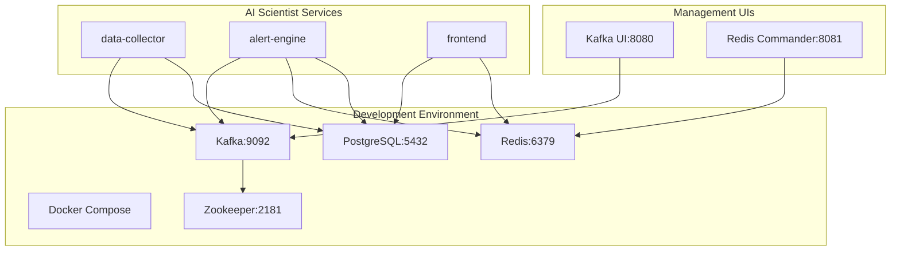

# AI Scientist Ecosystem - Infrastructure

Docker Compose setup and Infrastructure as Code for the AI Scientist Ecosystem.

## 🚀 Quick Start

### Prerequisites
- Docker & Docker Compose installed
- 4GB+ RAM available
- Ports 5432, 6379, 9092, 2181, 8080, 8081 available

### Setup Local Development Environment

```bash
# 1. Clone and setup
git clone https://github.com/ai-scientist-ecosystem/infra.git
cd infra

# 2. Configure environment
cp .env.example .env
# Edit .env with your API keys and passwords

# 3. Start all services
docker-compose up -d

# 4. Verify services are running
docker-compose ps
```

### Service URLs
- **Kafka UI**: http://localhost:8080 (manage Kafka topics)
- **Redis Commander**: http://localhost:8081 (browse Redis data)
- **PostgreSQL**: localhost:5432 (database)
- **Kafka**: localhost:9092 (message streaming)
- **Redis**: localhost:6379 (caching)

## 📋 Services Overview

| Service | Port | Purpose | Health Check |
|---------|------|---------|-------------|
| PostgreSQL | 5432 | Primary database | `pg_isready` |
| Redis | 6379 | Caching & sessions | `redis-cli ping` |
| Kafka | 9092 | Message streaming | `kafka-broker-api-versions` |
| Zookeeper | 2181 | Kafka coordination | `nc -z localhost 2181` |
| Kafka UI | 8080 | Web management | HTTP check |
| Redis Commander | 8081 | Redis web UI | HTTP check |

## 🗄️ Database Schema

The PostgreSQL database is automatically initialized with:
- `metrics` - Space weather data (Kp index, CME, solar flares)
- `alerts` - Generated alerts with severity levels
- `users` - User accounts and preferences
- `subscriptions` - User notification preferences
- `alert_deliveries` - Delivery tracking
- `system_health` - Service monitoring

## 🔧 Usage Examples

### Check Service Health
```bash
# All services
docker-compose ps

# Specific service logs
docker-compose logs -f kafka
docker-compose logs -f postgres
```

### Database Operations
```bash
# Connect to PostgreSQL
docker-compose exec postgres psql -U ai_user -d ai_scientist

# Run queries
\dt  -- List tables
SELECT * FROM metrics LIMIT 5;
SELECT * FROM alerts WHERE severity = 'WARNING';
```

### Kafka Operations
```bash
# Create topics for development
docker-compose exec kafka kafka-topics --create --bootstrap-server localhost:9092 --topic space-weather-raw --partitions 3 --replication-factor 1
docker-compose exec kafka kafka-topics --create --bootstrap-server localhost:9092 --topic alerts --partitions 3 --replication-factor 1

# List topics
docker-compose exec kafka kafka-topics --list --bootstrap-server localhost:9092
```

### Redis Operations
```bash
# Connect to Redis CLI
docker-compose exec redis redis-cli

# Test caching
SET kp_index:latest "5.2"
GET kp_index:latest
```

## 🛠️ Troubleshooting

### Common Issues

**Port conflicts:**
```bash
# Check what's using ports
netstat -an | findstr :9092
netstat -an | findstr :5432
```

**Services not starting:**
```bash
# Check logs
docker-compose logs service-name

# Restart specific service
docker-compose restart kafka
```

**Database connection issues:**
```bash
# Verify PostgreSQL is ready
docker-compose exec postgres pg_isready -U ai_user

# Reset database
docker-compose down -v
docker-compose up -d
```

## 🏗️ Architecture



## 📁 Project Structure
```
infra/
├── docker-compose.yml     # Main orchestration file
├── .env.example          # Environment template
├── sql/
│   └── init/
│       └── 01_init_schema.sql  # Database schema
├── iac/                  # Infrastructure as Code
└── README.md            # This file
```

## 🔐 Security Notes

⚠️ **Development Only**: Default passwords are for development only!

For production:
1. Change all passwords in `.env`
2. Use proper TLS certificates
3. Configure network security groups
4. Enable PostgreSQL SSL
5. Use Redis AUTH

## 🎯 Next Steps

1. **Setup complete** ✅
2. **Start data-collector service** → Fetch NOAA Kp index
3. **Start alert-engine service** → Process alerts from Kafka
4. **Start frontend service** → Display dashboard

## 🤝 Contributing

See the main [CONTRIBUTING.md](https://github.com/ai-scientist-ecosystem/meta/blob/main/CONTRIBUTING.md) for guidelines.

## 📞 Support

- **Issues**: [GitHub Issues](https://github.com/ai-scientist-ecosystem/infra/issues)
- **Discussions**: [GitHub Discussions](https://github.com/ai-scientist-ecosystem/meta/discussions)

---

*Part of the [AI Scientist Ecosystem](https://github.com/ai-scientist-ecosystem) - Protecting humanity through science and early warning systems* 🛡️
